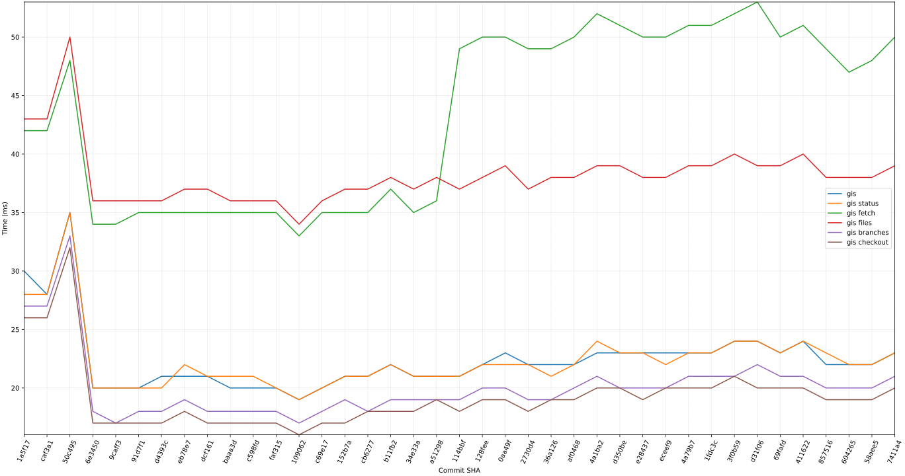
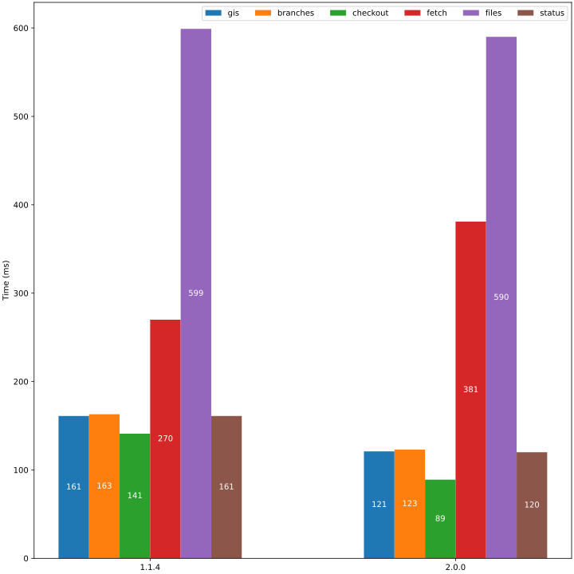

# Gis Performance trend throughout changes






# Purpose of this repository

This is a downstream repository, it is triggered automatically by upstream repo: https://github.com/nqminhuit/gis when:

1. any changes to gis **master** branch: will perform stress test on **small** dataset
2. when gis publishes a new **release**: will perform stress test on both **small** and **large** dataset


Each job will generate a report at summary step, can be found at: https://github.com/nqminhuit/gis-stress-test/actions

# Implementation

## Gitbucket Howto

Build and deploy:
```bash
podman build -t gitbucket:4.41.0 .
podman run -d -p 9898:8080 --name gitbucket gitbucket:4.41.0
```
app is available at: http://localhost:9898/

or use official docker image:
```bash
podman run -d -p 8080:8080 ghcr.io/gitbucket/gitbucket:4.39.0
```

Sign in with `root/root`

create new repository with basic auth token (root:root):
```
curl -X POST -H "Accept: application/json" -H "authorization: Basic cm9vdDpyb290" http://localhost:9898/api/v3/user/repos -d '{"name":"Hello-World","private":false}'
```

## Python Matplotlib

```bash
python3 -m venv /tmp/python
source /tmp/python/bin/activate
python -m pip install --upgrade pip
pip install matplotlib PyQt6
```
